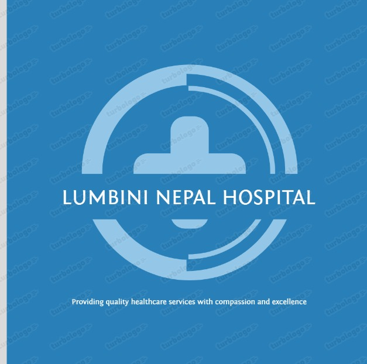

# 🏥 Lumbini Nepal Hospital Management System

<div align="center">
  
  <h3>Modern Healthcare Management Solution</h3>
  <p>A comprehensive hospital management system built with the MERN stack</p>
</div>

<p align="center">
  
  
  
  
</p>

## ✨ Features

### 👤 Patient Portal
- **Account Management**
  - Secure registration and login
  - Profile management
  - Medical history access
- **Appointment System**
  - Browse doctors by specialization
  - View doctor profiles & availability
  - Schedule/cancel appointments
- **Medical Records**
  - Access prescriptions
  - View treatment history
  - Download medical reports

### 👨‍⚕️ Doctor Dashboard
- **Profile Management**
  - Professional profile setup
  - Availability management
  - Consultation fee settings
- **Patient Care**
  - Appointment management
  - Digital prescription writing
  - Patient history access
  - Treatment records management

### 👑 Admin Control Panel
- **User Management**
  - Doctor registration approval
  - Patient account oversight
  - Staff access control
- **Hospital Operations**
  - Department management
  - Appointment oversight
  - System configuration
- **Analytics**
  - Patient statistics
  - Appointment analytics
  - Revenue reports

## 🛠️ Tech Stack

### Frontend
- **React.js** - UI development
- **Material UI** - Component library
- **Axios** - API communication
- **JWT** - Authentication
- **Formik & Yup** - Form handling & validation

### Backend
- **Node.js** - Runtime environment
- **Express.js** - Web framework
- **MongoDB** - Database
- **Mongoose** - ODM
- **JWT** - Authentication
- **bcrypt** - Password hashing

## 🚀 Getting Started

### Prerequisites
- Node.js (v14 or higher)
- MongoDB
- npm or yarn

### Installation

1. Clone the repository
```bash
git clone https://github.com/npanthi718/Lumbini-Nepal-Hospital--MERN-Stack-Project.git
cd Lumbini-Nepal-Hospital--MERN-Stack-Project
```

2. Install dependencies
```bash
# Install backend/ frontend dependencies

npm install
npm run build

```

3. Environment Setup
Create a `.env` file in the root directory:
```env
MONGO_URI=your_mongodb_connection_string
JWT_SECRET=your_jwt_secret_key
PORT=5000
NODE_ENV=development
```

4. Start the application
```bash
# Start backend/ frontend simultaneously by only:
npm run dev

```

---

## 📽️ **Demo Video**

Watch the full demo of the **Hospital Management System** showcasing all features and functionalities:

[

Click the link above to view the video.

---

## 🔑 Default Credentials

### Admin Access
- **Email:** superadmin@lumbinihospital.com  or  your_post_of_management@lumbinihospital.com
- **Password:** superadmin@123               or  your_post123


### Doctor Access
- **Email:** doctor_firstname.lastname@lumbinihospital.com
- **Password:** password123

## 📱 UI Snapshots

<div align="center">
  
  
  
  
  
  
  
  
  
  
  
</div>

## 🔒 Security Features

- JWT based authentication
- Password hashing with bcrypt
- Role-based access control
- HTTP-only cookies
- XSS protection
- CORS configuration

## 🤝 Contributing

1. Fork the repository
2. Create your feature branch (`git checkout -b feature/AmazingFeature`)
3. Commit your changes (`git commit -m 'Add some AmazingFeature'`)
4. Push to the branch (`git push origin feature/AmazingFeature`)
5. Open a Pull Request

## 📄 License

This project is licensed under the MIT License - see the [LICENSE](LICENSE) file for details.

## 👥 Team

- **Sushil Panthi** - _Initial work_ - [GitHub](https://github.com/npanthi718)

## 📞 Support

For support, email info@lumbininepalhospital.com or npanthi718@gmail.com

---

<div align="center">
  Made with ❤️ by Sushil Panthi
  <br />
  © 2025 Lumbini Nepal Hospital. All rights reserved.
</div>
